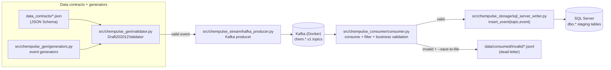

# ChemPulse

**ChemPulse** is a small, portfolio-grade Data Engineering project that demonstrates an end-to-end **near real-time** pipeline for an industrial / laboratory domain:

**Kafka (Docker) → Python Consumer (validation & routing) → SQL Server staging**, with a **dead-letter queue (JSONL)** for invalid events and a small **analytics layer (SQL views)**.

**Why it’s “senior/HR friendly”:**
- Multi-topic streaming pipeline (same code handles multiple event types)
- Data contracts with **JSON Schema** + generators
- Business validation per topic + explicit routing to **valid/invalid**
- SQL Server sink with **topic→table mapping** + **deduplication by `event_id`**
- Unit + integration tests (pytest) and a reproducible local setup

---

## Executive summary (TL;DR)

- **Kafka topics:** `chem.*.v1` (sensor readings, lab results, material movements, chemical master data)
- **Producer:** generates one valid event per topic after JSON Schema validation
- **Consumer:** reads a topic, optionally filters events, applies business validation, inserts valid data to SQL Server, and writes invalid events to `data/consumed/invalid/*.jsonl`
- **Storage:** SQL Server tables (`dbo.*`) with `event_id` as primary key (dedup handled automatically)
- **Analytics:** example SQL views aggregating sensor metrics, lab status counts, material flow, active chemicals

---

## Business problem & goals

In chemical manufacturing and labs, data arrives continuously from multiple systems and has different semantics:

- **SCADA/MES**: process measurements (sensors)
- **Laboratory systems**: quality tests and statuses
- **Warehouse/operations**: material movement transactions
- **MDM**: reference/master data for chemicals

**ChemPulse goals:**
1. Define and validate stable **data contracts** (JSON Schema) per topic.
2. Stream events with Kafka and keep a clean **topic/version naming** convention.
3. Apply a second layer of **business validation** (beyond schema correctness).
4. Route invalid events into a **dead-letter JSONL** store for inspection and reprocessing.
5. Load valid events into **SQL Server staging tables** per topic.
6. Offer a minimal, transparent analytics layer via **SQL views**.
7. Provide a small, meaningful test suite and a reliable local setup.

---

## Architecture & components

### Data flow (high-level)



### Technologies (approx. versions)

**Core runtime:**
- **Python:** `>= 3.10` (see [`pyproject.toml`](pyproject.toml))
- **Kafka (Docker):**
  - `confluentinc/cp-kafka:7.6.1`
  - `confluentinc/cp-zookeeper:7.6.1`
  - Docker Compose file version: `3.8` (see [`infra/docker-compose.yml`](infra/docker-compose.yml))
- **SQL Server:** local instance (e.g., SQL Server Express/Developer; project assumes you have it installed)
- **ODBC Driver:** default is `ODBC Driver 17 for SQL Server`

**Python libraries used:**
- `kafka-python`
- `jsonschema` (Draft 2020-12)
- `pyodbc`
- `python-dotenv`
- `pytest`

> Note: dependencies are intentionally not pinned in `pyproject.toml` yet (portfolio simplification). A future improvement is to add `requirements.txt` or Poetry/uv lock files.

---

## Data model & contracts

### Kafka topics

ChemPulse uses versioned topic names:

- `chem.sensor_readings.v1`
- `chem.lab_results.v1`
- `chem.material_movements.v1`
- `chem.chemical_mdm.v1`

Each topic has a JSON Schema contract under [`data_contracts/`](data_contracts/), validated by:
- [`src/chempulse_gen/validator.py`](src/chempulse_gen/validator.py)

Example schema highlights:
- `quality_flag`: enum `["OK", "WARN", "BAD"]` in sensor and lab contracts
- `movement_type`: enum `["TRANSFER", "CONSUMPTION", "RECEIPT", "DISPOSAL"]`
- `status`: enum `["COMPLETED", "PENDING", "CANCELLED"]` (material movements)

### Topic → SQL table → key columns (concise)

| Kafka topic | SQL table | Key columns (short) |
|---|---|---|
| `chem.sensor_readings.v1` | `dbo.sensor_readings` | `event_id` (PK), `equipment_id`, `sensor_id`, `metric_name`, `metric_value`, `quality_flag` |
| `chem.lab_results.v1` | `dbo.lab_results` | `event_id` (PK), `sample_id`, `test_code`, `result_value`, `result_status`, `quality_flag` |
| `chem.material_movements.v1` | `dbo.material_movements` | `event_id` (PK), `movement_id`, `material_id`, `movement_type`, `quantity`, `status` |
| `chem.chemical_mdm.v1` | `dbo.chemical_mdm` | `event_id` (PK), `chemical_id`, `cas_number`, `is_active`, `version` |

### SQL Server writer mapping (source of truth)

All inserts go through a **single** function:

- `insert_event(topic: str, event: dict) -> bool`  
  in [`src/chempulse_storage/sql_server_writer.py`](src/chempulse_storage/sql_server_writer.py)

It uses two maps:

```python
TOPIC_TO_TABLE = {
  "chem.sensor_readings.v1": "dbo.sensor_readings",
  "chem.lab_results.v1": "dbo.lab_results",
  "chem.material_movements.v1": "dbo.material_movements",
  "chem.chemical_mdm.v1": "dbo.chemical_mdm",
}

TOPIC_TO_COLUMNS = {
  "chem.sensor_readings.v1": [
    "event_id", "event_ts", "ingestion_ts", "source_system",
    "equipment_id", "sensor_id", "batch_id",
    "metric_name", "metric_value", "metric_unit", "quality_flag",
  ],
  "chem.lab_results.v1": [
    "event_id", "event_ts", "ingestion_ts",
    "sample_id", "batch_id", "lab_id", "test_code",
    "result_value", "result_unit", "method_code",
    "analyst_id", "result_status", "quality_flag",
  ],
  "chem.material_movements.v1": [
    "event_id", "event_ts", "ingestion_ts",
    "movement_id", "material_id", "material_type",
    "batch_id", "from_location", "to_location",
    "quantity", "quantity_unit", "movement_type",
    "operator_id", "status",
  ],
  "chem.chemical_mdm.v1": [
    "event_id", "event_ts", "ingestion_ts",
    "chemical_id", "chemical_name", "cas_number",
    "hazard_class", "default_unit", "supplier_id",
    "is_active", "version",
  ],
}
```

**Important:** if you add a new field to schemas/generators and want it in SQL, you must update:
1) SQL DDL (table column), **and**
2) `TOPIC_TO_COLUMNS`.

---

## Development Timeline

```mermaid
flowchart LR
  A[Define JSON Schema contracts per topic] --> B[Implement generators and schema validation]
  B --> C[Add batch JSONL generation]
  C --> D[Configure Kafka in Docker Compose]
  D --> E[Implement Kafka producer]
  E --> F[Implement Kafka consumer with business validation]
  F --> G[Add SQL Server sink and deduplication]
  G --> H[Add analytics views in SQL Server]
  H --> I[Add unit and integration tests]
```

