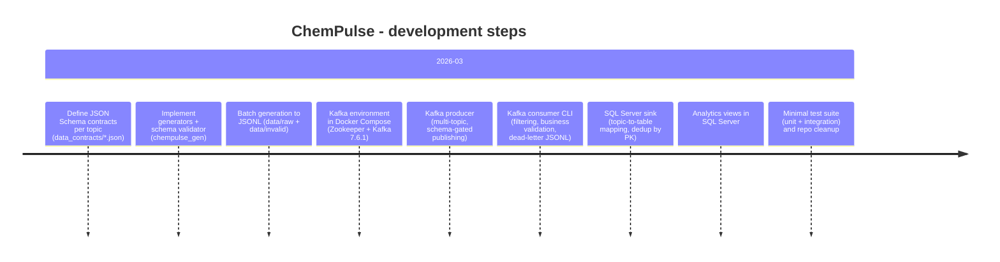

# ChemPulse

**ChemPulse** is a small, portfolio-grade Data Engineering project that demonstrates an end-to-end **near real-time** pipeline for an industrial / laboratory domain:

**Kafka (Docker) → Python Consumer (validation & routing) → SQL Server staging**, with a **dead-letter queue (JSONL)** for invalid events and a small **analytics layer (SQL views)**.

**Why it’s “senior/HR friendly”:**
- Multi-topic streaming pipeline (same code handles multiple event types)
- Data contracts with **JSON Schema** + generators
- Business validation per topic + explicit routing to **valid/invalid**
- SQL Server sink with **topic→table mapping** + **deduplication by `event_id`**
- Unit + integration tests (pytest) and a reproducible local setup

---

## Executive summary (TL;DR)

- **Kafka topics:** `chem.*.v1` (sensor readings, lab results, material movements, chemical master data)
- **Producer:** generates one valid event per topic after JSON Schema validation
- **Consumer:** reads a topic, optionally filters events, applies business validation, inserts valid data to SQL Server, and writes invalid events to `data/consumed/invalid/*.jsonl`
- **Storage:** SQL Server tables (`dbo.*`) with `event_id` as primary key (dedup handled automatically)
- **Analytics:** example SQL views aggregating sensor metrics, lab status counts, material flow, active chemicals

---

## Business problem & goals

In chemical manufacturing and labs, data arrives continuously from multiple systems and has different semantics:

- **SCADA/MES**: process measurements (sensors)
- **Laboratory systems**: quality tests and statuses
- **Warehouse/operations**: material movement transactions
- **MDM**: reference/master data for chemicals

**ChemPulse goals:**
1. Define and validate stable **data contracts** (JSON Schema) per topic.
2. Stream events with Kafka and keep a clean **topic/version naming** convention.
3. Apply a second layer of **business validation** (beyond schema correctness).
4. Route invalid events into a **dead-letter JSONL** store for inspection and reprocessing.
5. Load valid events into **SQL Server staging tables** per topic.
6. Offer a minimal, transparent analytics layer via **SQL views**.
7. Provide a small, meaningful test suite and a reliable local setup.

---

## Architecture & components

```mermaid
flowchart LR
  subgraph GEN["Data contracts + generators"]
    SCHEMA["data_contracts/*.json<br/>(JSON Schema)"] --> VALIDATOR["src/chempulse_gen/validator.py<br/>Draft202012Validator"]
    GENERATORS["src/chempulse_gen/generators.py<br/>event generators"] --> VALIDATOR
  end

  VALIDATOR -->|valid event| PRODUCER["src/chempulse_stream/kafka_producer.py<br/>Kafka producer"]
  PRODUCER --> KAFKA[("Kafka (Docker)<br/>chem.*.v1 topics")]

  KAFKA --> CONSUMER["src/chempulse_consumer/consumer.py<br/>consume + filter + business validation"]
  CONSUMER -->|valid| WRITER["src/chempulse_storage/sql_server_writer.py<br/>insert_event(topic,event)"]
  WRITER --> SQL[("SQL Server<br/>dbo.* staging tables")]

  CONSUMER -->|invalid + --save-to-file| DLQ["data/consumed/invalid/*.jsonl<br/>(dead-letter)"]

### Data flow (high-level)

```mermaid
flowchart LR
  subgraph GEN["Data contracts + generators"]
    SCHEMA["data_contracts/*.json<br/>(JSON Schema)"] --> VALIDATOR["src/chempulse_gen/validator.py<br/>Draft202012Validator"]
    GENERATORS["src/chempulse_gen/generators.py<br/>event generators"] --> VALIDATOR
  end

  VALIDATOR -->|valid event| PRODUCER["src/chempulse_stream/kafka_producer.py<br/>Kafka producer"]
  PRODUCER --> KAFKA[("Kafka (Docker)<br/>chem.*.v1 topics")]

  KAFKA --> CONSUMER["src/chempulse_consumer/consumer.py<br/>consume + filter + business validation"]
  CONSUMER -->|valid| WRITER["src/chempulse_storage/sql_server_writer.py<br/>insert_event(topic,event)"]
  WRITER --> SQL[("SQL Server<br/>dbo.* staging tables")]

  CONSUMER -->|invalid + --save-to-file| DLQ["data/consumed/invalid/*.jsonl<br/>(dead-letter)"]
```

### Repo navigation (primary entry points)

- Kafka Docker Compose: [`infra/docker-compose.yml`](infra/docker-compose.yml)
- Producer (Kafka): [`src/chempulse_stream/kafka_producer.py`](src/chempulse_stream/kafka_producer.py)
- Consumer CLI (Kafka → SQL / DLQ): [`src/chempulse_consumer/consumer.py`](src/chempulse_consumer/consumer.py)
- Business validation rules: [`src/chempulse_consumer/validation.py`](src/chempulse_consumer/validation.py)
- Routing to JSONL paths: [`src/chempulse_consumer/routing.py`](src/chempulse_consumer/routing.py)
- SQL Server sink + mapping: [`src/chempulse_storage/sql_server_writer.py`](src/chempulse_storage/sql_server_writer.py)
- SQL connection smoke test: [`src/chempulse_storage/test_connection.py`](src/chempulse_storage/test_connection.py)
- Batch JSONL generator (offline): [`src/chempulse_gen/generate_data.py`](src/chempulse_gen/generate_data.py)
- JSON Schemas: [`data_contracts/`](data_contracts/)
- Tests: [`tests/unit/`](tests/unit/) and [`tests/integration/`](tests/integration/)

### Repository layout (simplified)

```text
ChemPulse/
├─ data_contracts/                 # JSON Schema contracts per topic
├─ infra/
│  └─ docker-compose.yml           # Kafka + Zookeeper
├─ src/
│  ├─ chempulse_consumer/          # consumer + validation + routing
│  ├─ chempulse_gen/               # generators + schema validator + batch generation
│  ├─ chempulse_storage/           # SQL Server writer + connection test
│  └─ chempulse_stream/            # Kafka producer
├─ tests/
│  ├─ unit/
│  └─ integration/
├─ .env.example                    # env template (see note about variable names)
└─ pyproject.toml
```

---

## Technologies (approx. versions)

**Core runtime:**
- **Python:** `>= 3.10` (see [`pyproject.toml`](pyproject.toml))
- **Kafka (Docker):**
  - `confluentinc/cp-kafka:7.6.1`
  - `confluentinc/cp-zookeeper:7.6.1`
  - Docker Compose file version: `3.8` (see [`infra/docker-compose.yml`](infra/docker-compose.yml))
- **SQL Server:** local instance (e.g., SQL Server Express/Developer; project assumes you have it installed)
- **ODBC Driver:** default is `ODBC Driver 17 for SQL Server`

**Python libraries used:**
- `kafka-python`
- `jsonschema` (Draft 2020-12)
- `pyodbc`
- `python-dotenv`
- `pytest`

> Note: dependencies are intentionally not pinned in `pyproject.toml` yet (portfolio simplification). A future improvement is to add `requirements.txt` or Poetry/uv lock files.

---

## Data model & contracts

### Kafka topics

ChemPulse uses versioned topic names:

- `chem.sensor_readings.v1`
- `chem.lab_results.v1`
- `chem.material_movements.v1`
- `chem.chemical_mdm.v1`

Each topic has a JSON Schema contract under [`data_contracts/`](data_contracts/), validated by:
- [`src/chempulse_gen/validator.py`](src/chempulse_gen/validator.py)

Example schema highlights:
- `quality_flag`: enum `["OK", "WARN", "BAD"]` in sensor and lab contracts
- `movement_type`: enum `["TRANSFER", "CONSUMPTION", "RECEIPT", "DISPOSAL"]`
- `status`: enum `["COMPLETED", "PENDING", "CANCELLED"]` (material movements)

### Topic → SQL table → key columns (concise)

| Kafka topic | SQL table | Key columns (short) |
|---|---|---|
| `chem.sensor_readings.v1` | `dbo.sensor_readings` | `event_id` (PK), `equipment_id`, `sensor_id`, `metric_name`, `metric_value`, `quality_flag` |
| `chem.lab_results.v1` | `dbo.lab_results` | `event_id` (PK), `sample_id`, `test_code`, `result_value`, `result_status`, `quality_flag` |
| `chem.material_movements.v1` | `dbo.material_movements` | `event_id` (PK), `movement_id`, `material_id`, `movement_type`, `quantity`, `status` |
| `chem.chemical_mdm.v1` | `dbo.chemical_mdm` | `event_id` (PK), `chemical_id`, `cas_number`, `is_active`, `version` |

### SQL Server writer mapping (source of truth)

All inserts go through a **single** function:

- `insert_event(topic: str, event: dict) -> bool`  
  in [`src/chempulse_storage/sql_server_writer.py`](src/chempulse_storage/sql_server_writer.py)

It uses two maps:

```python
TOPIC_TO_TABLE = {
  "chem.sensor_readings.v1": "dbo.sensor_readings",
  "chem.lab_results.v1": "dbo.lab_results",
  "chem.material_movements.v1": "dbo.material_movements",
  "chem.chemical_mdm.v1": "dbo.chemical_mdm",
}

TOPIC_TO_COLUMNS = {
  "chem.sensor_readings.v1": [
    "event_id", "event_ts", "ingestion_ts", "source_system",
    "equipment_id", "sensor_id", "batch_id",
    "metric_name", "metric_value", "metric_unit", "quality_flag",
  ],
  "chem.lab_results.v1": [
    "event_id", "event_ts", "ingestion_ts",
    "sample_id", "batch_id", "lab_id", "test_code",
    "result_value", "result_unit", "method_code",
    "analyst_id", "result_status", "quality_flag",
  ],
  "chem.material_movements.v1": [
    "event_id", "event_ts", "ingestion_ts",
    "movement_id", "material_id", "material_type",
    "batch_id", "from_location", "to_location",
    "quantity", "quantity_unit", "movement_type",
    "operator_id", "status",
  ],
  "chem.chemical_mdm.v1": [
    "event_id", "event_ts", "ingestion_ts",
    "chemical_id", "chemical_name", "cas_number",
    "hazard_class", "default_unit", "supplier_id",
    "is_active", "version",
  ],
}
```

**Important:** if you add a new field to schemas/generators and want it in SQL, you must update:
1) SQL DDL (table column), **and**
2) `TOPIC_TO_COLUMNS`.

---

## Setup & running locally (step-by-step)

### Prerequisites

- Docker + Docker Compose
- Python `>=3.10`
- SQL Server installed locally (Express/Developer is fine)
- ODBC driver installed (default: **ODBC Driver 17 for SQL Server**)

### 1) Clone & create virtual environment

```bash
git clone https://github.com/Soriader/ChemPulse.git
cd ChemPulse

python -m venv .venv
```

Activate:

**PowerShell (Windows):**
```powershell
.\.venv\Scripts\Activate.ps1
```

**bash/zsh (Linux/macOS):**
```bash
source .venv/bin/activate
```

Install dependencies:

```bash
python -m pip install --upgrade pip
pip install -e .
pip install kafka-python jsonschema python-dotenv pyodbc pytest
```

### 2) Configure SQL Server connection (`.env`)

The repo includes [`.env.example`](.env.example), but **note**: the code expects `DB_USERNAME` (not `DB_USER`).

Create `.env` at repository root:

```env
# SQL Server host + database
DB_SERVER=localhost
DB_NAME=ChemPulse

# If using SQL Authentication:
DB_USERNAME=sa
DB_PASSWORD=YourStrongPassword

# ODBC driver
DB_DRIVER=ODBC Driver 17 for SQL Server

# Optional (default is "yes" in code):
DB_TRUST_SERVER_CERTIFICATE=yes
```

- If `DB_USERNAME` and `DB_PASSWORD` are **not set**, `sql_server_writer.py` falls back to:
  - `Trusted_Connection=yes` (Windows Integrated Security).

### 3) Start Kafka (Docker Compose)

```bash
docker compose -f infra/docker-compose.yml up -d
docker ps
```

Kafka is exposed on host:
- `localhost:29092` (this is what producer/consumer use by default)

Stop:

```bash
docker compose -f infra/docker-compose.yml down
```

### 4) Create SQL Server database + tables + example views

Run the SQL below in SSMS or your SQL client.

```sql
-- 1) Database
IF DB_ID('ChemPulse') IS NULL
BEGIN
  CREATE DATABASE ChemPulse;
END
GO
USE ChemPulse;
GO

-- 2) Staging tables (1 per topic)

IF OBJECT_ID('dbo.sensor_readings','U') IS NULL
BEGIN
  CREATE TABLE dbo.sensor_readings (
      event_id       NVARCHAR(100)   NOT NULL PRIMARY KEY,
      event_ts       DATETIMEOFFSET  NULL,
      ingestion_ts   DATETIMEOFFSET  NULL,
      source_system  NVARCHAR(50)    NULL,
      equipment_id   NVARCHAR(50)    NULL,
      sensor_id      NVARCHAR(50)    NULL,
      batch_id       NVARCHAR(50)    NULL,
      metric_name    NVARCHAR(50)    NULL,
      metric_value   FLOAT          NULL,
      metric_unit    NVARCHAR(20)    NULL,
      quality_flag   NVARCHAR(20)    NULL
  );
END
GO

IF OBJECT_ID('dbo.lab_results','U') IS NULL
BEGIN
  CREATE TABLE dbo.lab_results (
      event_id       NVARCHAR(100)   NOT NULL PRIMARY KEY,
      event_ts       DATETIMEOFFSET  NULL,
      ingestion_ts   DATETIMEOFFSET  NULL,
      sample_id      NVARCHAR(50)    NULL,
      batch_id       NVARCHAR(50)    NULL,
      lab_id         NVARCHAR(50)    NULL,
      test_code      NVARCHAR(50)    NULL,
      result_value   FLOAT          NULL,
      result_unit    NVARCHAR(20)    NULL,
      method_code    NVARCHAR(50)    NULL,
      analyst_id     NVARCHAR(50)    NULL,
      result_status  NVARCHAR(20)    NULL,
      quality_flag   NVARCHAR(20)    NULL
  );
END
GO

IF OBJECT_ID('dbo.material_movements','U') IS NULL
BEGIN
  CREATE TABLE dbo.material_movements (
      event_id        NVARCHAR(100)   NOT NULL PRIMARY KEY,
      event_ts        DATETIMEOFFSET  NULL,
      ingestion_ts    DATETIMEOFFSET  NULL,
      movement_id     NVARCHAR(50)    NULL,
      material_id     NVARCHAR(50)    NULL,
      material_type   NVARCHAR(50)    NULL,
      batch_id        NVARCHAR(50)    NULL,
      from_location   NVARCHAR(50)    NULL,
      to_location     NVARCHAR(50)    NULL,
      quantity        FLOAT          NULL,
      quantity_unit   NVARCHAR(20)    NULL,
      movement_type   NVARCHAR(30)    NULL,
      operator_id     NVARCHAR(50)    NULL,
      status          NVARCHAR(20)    NULL
  );
END
GO

IF OBJECT_ID('dbo.chemical_mdm','U') IS NULL
BEGIN
  CREATE TABLE dbo.chemical_mdm (
      event_id       NVARCHAR(100)   NOT NULL PRIMARY KEY,
      event_ts       DATETIMEOFFSET  NULL,
      ingestion_ts   DATETIMEOFFSET  NULL,
      chemical_id    NVARCHAR(50)    NULL,
      chemical_name  NVARCHAR(100)   NULL,
      cas_number     NVARCHAR(30)    NULL,
      hazard_class   NVARCHAR(50)    NULL,
      default_unit   NVARCHAR(20)    NULL,
      supplier_id    NVARCHAR(50)    NULL,
      is_active      BIT            NULL,
      version        INT            NULL
  );
END
GO

-- 3) Example analytics views
-- Use CREATE OR ALTER to avoid "view already exists" errors.

CREATE OR ALTER VIEW dbo.vw_sensor_avg AS
SELECT
    equipment_id,
    metric_name,
    AVG(metric_value) AS avg_value,
    COUNT(*) AS reading_count
FROM dbo.sensor_readings
GROUP BY equipment_id, metric_name;
GO

CREATE OR ALTER VIEW dbo.vw_lab_result_status_counts AS
SELECT
    result_status,
    COUNT(*) AS result_count
FROM dbo.lab_results
GROUP BY result_status;
GO

CREATE OR ALTER VIEW dbo.vw_material_quantity_by_type AS
SELECT
    material_type,
    movement_type,
    SUM(quantity) AS total_quantity,
    COUNT(*) AS movement_count
FROM dbo.material_movements
GROUP BY material_type, movement_type;
GO

CREATE OR ALTER VIEW dbo.vw_active_chemicals AS
SELECT
    chemical_id,
    chemical_name,
    cas_number,
    hazard_class,
    default_unit,
    supplier_id,
    version
FROM dbo.chemical_mdm
WHERE is_active = 1;
GO
```

### 5) Smoke test SQL connectivity (optional but recommended)

```bash
python -m chempulse_storage.test_connection
```

Expected output:

```text
Connection successful.
Microsoft SQL Server <...version string...>
```

---

## Running the pipeline

### A) Stream: Producer → Kafka

The producer publishes **one valid event per topic** (validated against JSON Schema first):

```bash
python -m chempulse_stream.kafka_producer
```

Sample output:

```text
Published event to topic=chem.sensor_readings.v1, partition=0, offset=0
Published event to topic=chem.lab_results.v1, partition=0, offset=0
Published event to topic=chem.material_movements.v1, partition=0, offset=0
Published event to topic=chem.chemical_mdm.v1, partition=0, offset=0
```

### B) Stream: Consumer (Kafka → SQL / Dead-letter)

Consume a topic:

```bash
python -m chempulse_consumer.consumer --topic chem.sensor_readings.v1 --from-beginning --group-id chempulse-sensor-1 --save-to-file
```

Other topics:

```bash
python -m chempulse_consumer.consumer --topic chem.lab_results.v1 --from-beginning --group-id chempulse-lab-1 --save-to-file
python -m chempulse_consumer.consumer --topic chem.material_movements.v1 --from-beginning --group-id chempulse-move-1 --save-to-file
python -m chempulse_consumer.consumer --topic chem.chemical_mdm.v1 --from-beginning --group-id chempulse-mdm-1 --save-to-file
```

#### Filtering (useful for demos / debugging)

The consumer supports simple field filtering:

```bash
python -m chempulse_consumer.consumer \
  --topic chem.sensor_readings.v1 \
  --from-beginning \
  --event-field metric_name \
  --event-value humidity \
  --save-to-file
```

Filtering logic:
- If `--event-field` is not provided → all events pass.
- Otherwise `str(event.get(field)) == event_value` must match.

#### What gets written where?

- **Valid events:** inserted into SQL Server via [`insert_event`](src/chempulse_storage/sql_server_writer.py)
- **Invalid events:** written to dead-letter JSONL when `--save-to-file` is enabled:
  - `data/consumed/invalid/<topic_with_underscores>.jsonl`

> Note: the routing helper supports both `valid` and `invalid` paths, but the current `consumer.py` writes JSONL only for invalid events (dead-letter).

---

## Validation rules & routing logic

### Layer 1: Schema validation (producer / batch generator)

- Validator: [`src/chempulse_gen/validator.py`](src/chempulse_gen/validator.py)
- Contracts: [`data_contracts/*.json`](data_contracts/)

This ensures:
- required fields exist,
- types and formats match (e.g., `date-time`),
- enums are respected (`quality_flag`, `movement_type`, etc.).

### Layer 2: Business validation (consumer)

Business rules are intentionally simple and explicit in:
- [`src/chempulse_consumer/validation.py`](src/chempulse_consumer/validation.py)

Rules:

| Topic | Business-valid condition |
|---|---|
| `chem.sensor_readings.v1` | `quality_flag == "OK"` |
| `chem.lab_results.v1` | `quality_flag == "OK"` |
| `chem.material_movements.v1` | `status == "COMPLETED"` |
| `chem.chemical_mdm.v1` | `is_active is True` |
| unknown topic | invalid |

### Routing paths

Routing is defined in:
- [`src/chempulse_consumer/routing.py`](src/chempulse_consumer/routing.py)

Logic:
- Replace `.` with `_` in topic name
- Return one of:
  - `data/consumed/valid/<topic>.jsonl`
  - `data/consumed/invalid/<topic>.jsonl`

---

## Example terminal output (consumer)

```text
Listening on topic: chem.sensor_readings.v1
Bootstrap servers: localhost:29092
Group ID: chempulse-sensor-1
Waiting for messages...

=== NEW EVENT ===
Topic: chem.sensor_readings.v1
Partition: 0
Offset: 0
{
  "event_id": "cb3038e2-61ef-41ad-9a41-da2e43c4c4f6",
  "event_ts": "2026-03-17T12:30:29.760747+00:00",
  "ingestion_ts": "2026-03-19T21:29:34.760776+00:00",
  "source_system": "scada",
  "equipment_id": "EQ-198",
  "sensor_id": "SNS-603",
  "batch_id": "BATCH-032",
  "metric_name": "humidity",
  "metric_value": 38.42,
  "metric_unit": "%",
  "quality_flag": "OK"
}

Skipped duplicate event in SQL Server

=== NEW EVENT ===
Topic: chem.sensor_readings.v1
Partition: 0
Offset: 1
{
  "event_id": "...",
  "...": "...",
  "quality_flag": "BAD"
}

Saved to: data/consumed/invalid/chem_sensor_readings_v1.jsonl
```

> Known minor issue: the consumer prints `"Saved to SQL Server: dbo.sensor_readings"` for any topic. This is only a log message; the actual insert destination is controlled by `TOPIC_TO_TABLE` in `sql_server_writer.py`.

---

## Example SQL queries (verification & analytics)

### Verify raw staging tables

```sql
USE ChemPulse;
GO

SELECT TOP (10) * FROM dbo.sensor_readings ORDER BY ingestion_ts DESC;
SELECT TOP (10) * FROM dbo.lab_results ORDER BY ingestion_ts DESC;
SELECT TOP (10) * FROM dbo.material_movements ORDER BY ingestion_ts DESC;
SELECT TOP (10) * FROM dbo.chemical_mdm ORDER BY ingestion_ts DESC;
```

### Verify analytics views

```sql
SELECT TOP (10) * FROM dbo.vw_sensor_avg;
SELECT TOP (10) * FROM dbo.vw_lab_result_status_counts;
SELECT TOP (10) * FROM dbo.vw_material_quantity_by_type;
SELECT TOP (10) * FROM dbo.vw_active_chemicals;
```

Sample result shapes:
- `vw_sensor_avg`: `equipment_id`, `metric_name`, `avg_value`, `reading_count`
- `vw_lab_result_status_counts`: `result_status`, `result_count`
- `vw_material_quantity_by_type`: `material_type`, `movement_type`, `total_quantity`, `movement_count`
- `vw_active_chemicals`: active chemicals list

---

## Optional: batch file generation (offline)

You can generate validated JSONL datasets for offline inspection:

```bash
python -m chempulse_gen.generate_data
```

Creates:
- valid files in `data/raw/` (one JSONL per topic)
- invalid files in `data/invalid/` (one JSONL per topic)

Example output:

```text
Generated and validated ChemPulse event files:
 - sensor_readings: valid=200, invalid=...
 - lab_results: valid=100, invalid=...
 - material_movements: valid=80, invalid=...
 - chemical_mdm: valid=20, invalid=...
```

> These directories are ignored by Git (see [`.gitignore`](.gitignore)).

---

## Testing

### Run tests

**PowerShell (Windows):**
```powershell
$env:PYTHONPATH="src"
python -m pytest
```

**bash/zsh (Linux/macOS):**
```bash
export PYTHONPATH=src
python -m pytest
```

### Expected pytest output

```text
collected 12 items

tests\integration\test_generate_data_pipeline.py .                           [  8%]
tests\unit\test_consumer_logic.py ........                                  [ 75%]
tests\unit\test_validator.py ...                                            [100%]

12 passed in 0.8s
```

### Do tests require Docker / Kafka / SQL Server?

No. Current tests focus on:
- schema validation (`validate_records`)
- business validation (`is_valid_event`)
- routing (`route_event`)
- batch generator output files
- a lightweight writer mapping sanity check

End-to-end verification (Kafka → SQL) is done via the runtime instructions above.

---

## Troubleshooting (common pitfalls)

### 1) SQL view error: “There is already an object named 'vw_sensor_avg'…”

Cause: trying to `CREATE VIEW` when the view already exists.

Fix: use either:
- `ALTER VIEW`, or
- recommended: `CREATE OR ALTER VIEW` (included in this README).

### 2) Data inserted as `NULL` even though events contain values

Most common cause: **mapping mismatch** between:
- event JSON keys,
- `TOPIC_TO_COLUMNS`,
- SQL table column names.

Checklist:
1. Inspect the event printed by the consumer.
2. Compare keys with [`TOPIC_TO_COLUMNS`](src/chempulse_storage/sql_server_writer.py).
3. Compare columns with the SQL DDL.
4. Fix either mapping or table DDL (keep them consistent).

### 3) “Validation false positives” (everything routed as invalid)

Cause: business rules in [`validation.py`](src/chempulse_consumer/validation.py) don’t match your generator/data.
- Example: your events have `status="PENDING"` but you expect valid rows.

Fix:
- Adjust your data generator or update business validation rules.

### 4) Monkeypatch pitfall in tests (`pytest`): patching doesn’t work

If you do:

```python
from chempulse_storage.sql_server_writer import insert_event
```

…then patching `chempulse_storage.sql_server_writer.insert_event` won’t affect the already-imported local reference.

**Correct approach:** import the module and patch the attribute on the module object:

```python
import chempulse_storage.sql_server_writer as sql_writer
monkeypatch.setattr(sql_writer, "insert_event", mock_insert)
```

See: [`tests/unit/test_consumer_logic.py`](tests/unit/test_consumer_logic.py)

### 5) Kafka connection errors (`NoBrokersAvailable`)

Checklist:
- `docker ps` → containers should be running
- use `localhost:29092` on the host (this is the advertised listener)
- `infra/docker-compose.yml` exposes both `9092` and `29092`; host clients should use **29092**

### 6) pyodbc driver errors (`IM002`, missing driver, SSL/cert)

Checklist:
- install **ODBC Driver 17 for SQL Server**, or set `DB_DRIVER` to what you have
- if you see certificate issues, set:
  - `DB_TRUST_SERVER_CERTIFICATE=yes`

---

## Suggested next improvements (roadmap)

If you want to take this from “portfolio” to “junior production-grade”:

1. Add a proper dependency file (`requirements.txt` / Poetry / uv) and pin versions.
2. Add CI (GitHub Actions): `pytest`, `ruff`, `black --check`.
3. Add an optional mode to also write **valid events to JSONL** (currently only dead-letter is persisted).
4. Add end-to-end integration tests (Kafka + SQL Server in containers; publish → consume → SELECT).
5. Add structured logging + metrics (valid/invalid counts, lag, insert duration).
6. Add migrations / schema management (SQL scripts in `sql/` or a migration tool).
7. Improve consumer logging (print actual table name from `TOPIC_TO_TABLE`).

---

## How to present ChemPulse in your CV (example bullets)

- Built a streaming pipeline **Kafka → Python consumer → SQL Server** handling multiple industrial/lab event types (sensor readings, lab QC results, material movements, chemical MDM).
- Implemented **data contracts** using JSON Schema (Draft 2020‑12) and generated synthetic events for repeatable demos.
- Added **per-topic business validation** and a **dead-letter JSONL** store for invalid events.
- Implemented SQL Server sink using **topic→table→columns mapping** and **deduplication by primary key** (`event_id`).
- Delivered a minimal but relevant test suite: unit tests for validation/routing + integration tests for batch dataset generation.

---

## Recommended git commit messages (clean and “DE readable”)

- `feat(stream): add kafka producer with schema validation`
- `feat(consumer): add kafka consumer CLI with filtering and business validation`
- `feat(storage): add SQL Server writer with topic-to-table mapping and dedup`
- `feat(gen): add batch JSONL generator and schema validator`
- `test: add unit and integration tests for validation and generation pipeline`
- `docs: add polished README and troubleshooting notes`
- `chore: update .gitignore for env and local data outputs`

---

## Release checklist (v0.1.0)

- [ ] `python -m pytest` passes locally
- [ ] Kafka starts: `docker compose -f infra/docker-compose.yml up -d`
- [ ] Producer publishes all topics: `python -m chempulse_stream.kafka_producer`
- [ ] Consumer can read from beginning and insert into SQL Server for each topic
- [ ] Invalid events written to `data/consumed/invalid/*.jsonl` with `--save-to-file`
- [ ] `.env` is not committed (see [`.gitignore`](.gitignore))
- [ ] `data/raw`, `data/invalid`, `data/consumed` are not committed (see [`.gitignore`](.gitignore))
- [ ] SQL DDL matches `TOPIC_TO_COLUMNS`
- [ ] Views created with `CREATE OR ALTER VIEW`

---

## Development timeline (Mermaid)

